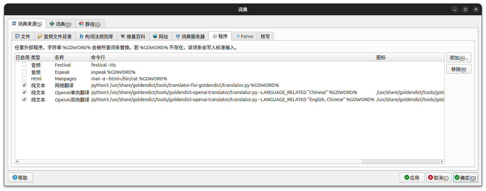
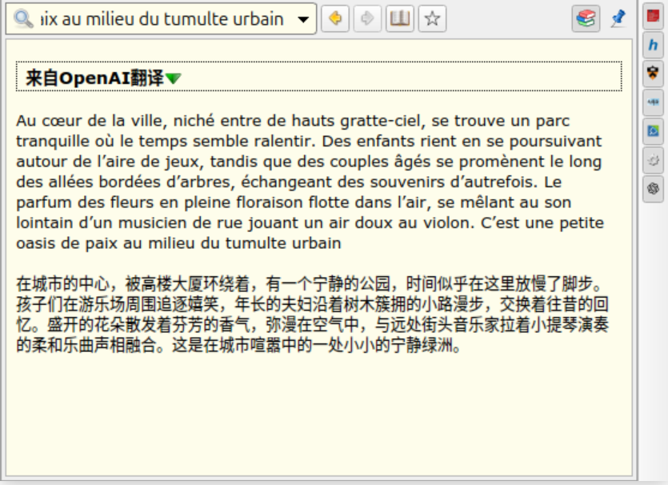

# GoldenDict-openai-translator

结合 OpenAI 进行文本翻译的命令行翻译工具，主要作为 GoldenDict 翻译扩展

## Preface

命令行翻译工具，主要用于搭配 GoldenDict，特性如下：

- 使用 openai 库，借助 OpenAI 进行文本翻译，可以在配置文件中手动指定使用的 Model、翻译相关的语言等
  - 需要提供 API Key 和 Host，获取免费API可以参考 [chatanywhere/GPT_API_free](https://github.com/chatanywhere/GPT_API_free) 等

- 兼容linux、windows
  - 注意windows下官方GoldenDict不支持utf-8字符输出，可以使用非官方维护的GoldenDict，如 [goldendict-ng](https://github.com/xiaoyifang/goldendict-ng) 的最新版本；linux下没有官方版本没有此问题

## Requirements

Python 3.5+ 以及 openai 库：

```bash
pip install openai
```

Ubuntu24.04+限制pip进行扩展包安装，可以使用：

```bash
sudo apt-get install python3-openai
```

## Configuration

配置文件 `config.ini` 内容格式如下

```ini
[OpenAI]
OPENAI_API_KEY = sk-xxxxxxxxxxxxxxxxxx
OPENAI_BASE_URL = https://api.openai.com
OPENAI_MODEL = gpt-3.5-turbo
OPENAI_TEMPERATURE = 0.3
OPENAI_MAX_TOKENS = 1500
REQUEST_TIMEOUT = 15
LANGUAGE_RELATED = English, Chinese 
# or LANGUAGE_RELATED = Chinese, see below
```

需要在 `translator.py` 中手动更改 `initialization_file` 变量以指明配置文件所在位置（注意实现时使用了`os.path.expanduser()`，导致 windows 下不能使用相对路径）

## Usage

命令行格式

```bash
python translator.py {文字}
```

测试：

```bash
python translator.py 今天早上Mike推荐了我看DesiringClick上面一篇关于ColorSpace的文章
```

输出：

```
今天早上Mike推荐了我看DesiringClick上面一篇关于ColorSpace的文章
This morning Mike recommended me to read an article about ColorSpace on DesiringClick.
```

## Tips

### 配置文件说明

相关配置位于配置文件 `config.ini `中 [OpenAI] 下，包括：

- `OPENAI_API_KEY`  - 申请到的 API Key，**需要手动提供**
- `OPENAI_BASE_URL`  - 发出请求的目标 HOST，可以使用官方URL或代理，**需要手动提供**
- `OPENAI_MODEL`  - 想使用的 Model，默认值 `15`
- `OPENAI_TEMPERATURE`  - 发出请求时附带的 temperature 参数，用于控制执行翻译的随机性， 默认值 `0.3`
  - 取值低倾向标准化确定性强，取值高创造性强但取值过高可能出现错误
- `OPENAI_MAX_TOKENS`  - 限制 OpenAI 生成的回复的最大 token 数，避免超时等问题，默认值 `1500`
  - 1500 个 token 大致对应 6000 个英文字符或 1500 个汉字
- `LANGUAGE_RELATED`  - 翻译涉及的相关语言，其中允许提供一或两个值， 默认值 `English, Chinese`
  - 提供一个值，如 `LANGUAGE_RELATED = Chinese`
    - 此时该工具将任意语言的原文本翻译成指定语言，但不支持双向翻译
  - 提供两个值，其中一个是源语言，另一个是目标语言，如  `LANGUAGE_RELATED = English, Chinese`
    - 此时该工具在两种语言之间进行双向翻译，具体的源/目标语言由 OpenAI 结合原文本进行判断

### 词典集成

要将本工具集成到 GoldenDict，先进行 `config.ini` 文件的配置并在命令行下测试 Python 可以顺利运行该脚本，然后在GoldenDict中进行设置：
```bash
python <dir>/translator.py %GDWORD%
```

为与其他工具区分，可以在在图标一栏指定本工具使用的图标文件地址，如

```
D:\GoldenDict-ng\openai-translator-goldendict\openai.png
```



## Example

`LANGUAGE_RELATED = Chinese` 设置情况下对法语文本进行翻译的示例

